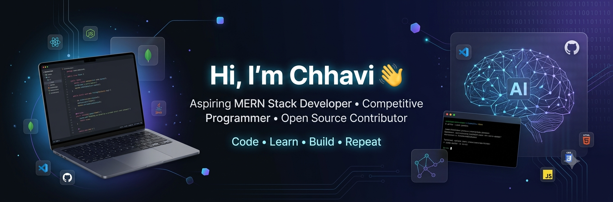

  

Passionate about building scalable web applications, solving challenging problems, and continuously learning new technologies.

---

## 🎓 Education

🏛️ **Maharaja Surajmal Institute of Technology (MSIT), New Delhi**  
🎓 Bachelor of Technology (B.Tech) in Computer Science Engineering  
📅 2024 - 2028  

---

## 👨‍💻 About Me

- 🌱 Currently learning and building with the **MERN Stack**.
- 💡 Passionate about **Data Structures & Algorithms** and problem-solving.
- ⚔️ Regularly practicing **Competitive Programming**.
- ## 🌐 Coding Profiles
- 🟠 [LeetCode](https://leetcode.com/u/CHHAVSS/)
- 🎯 Working towards becoming a Software Engineer who builds impactful products.
---

## 🛠️ Tech Stack

### 💻 Programming Languages

  
  
  
  
  
  
  

### 🌐 Web Development

  
  
  
  
  
  

### 🤖 AI / ML

  
  
  
  
  
  
  
  
  
  

### 🗄️ Data & Vector Stores

  
  
  
  
  
  

### ⚙️ Backend & Tools

  
  
  
  
  
  
  
  

### 🧠 Core Computer Science

  
  
  
  
  

## Tools

  

---

## 🚀 Current Focus

- 📚 Mastering Data Structures & Algorithms
- ⚔️ Competitive Programming
- 🌐 Full Stack Web Development (MERN)
- 🤝 Open Source Contributions
- 🏗️ Building Real-World Projects
- 🎯 Preparing for Software Engineering Internships

---

## 📈 GitHub Statistics

  

  

---
## 💻 Languages & Technologies

  

## 🟠 LeetCode Statistics

  

---

---

## 🌐 Connect With Me

  

  

📧 Email: thechhavi13@gmail.com

🔗 LinkedIn: https://www.linkedin.com/in/chhavi-31418231b/

💻 GitHub: https://github.com/chhavss

---

### ✨ Code • Learn • Build • Repeat

